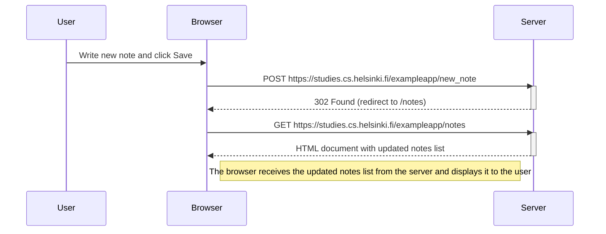
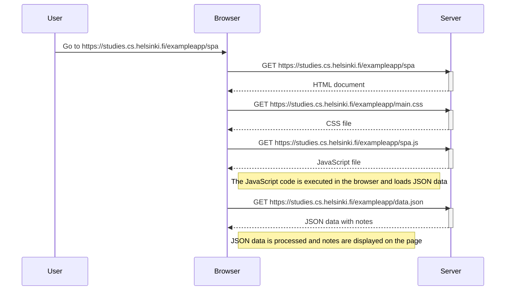
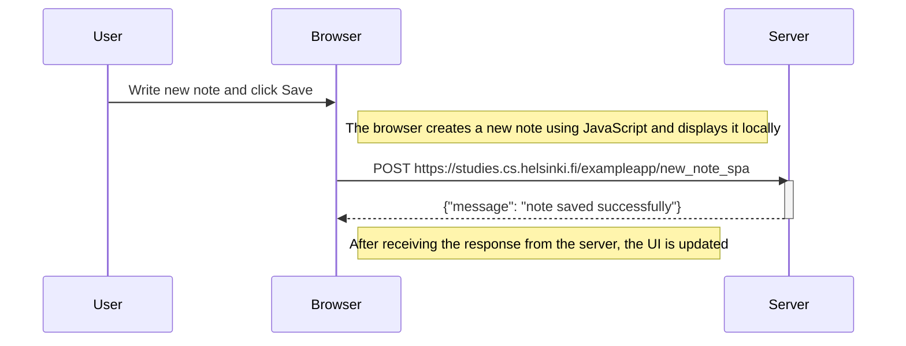

### Markdown Content for Your Assignment

Creating a Markdown file named `exercise.md` with the following content:

````markdown
# Exercise 0.4: New Note Diagram


````

# Exercise 0.5: Single Page App Diagram



# Exercise 0.6: New Note in Single Page App Diagram



I have completed exercises 0.4, 0.5, and 0.6 as part of this assignment. The diagrams were created using the Mermaid syntax and have been tested to ensure proper rendering on GitHub.

I encountered some challenges with the initial rendering of the diagrams, but resolved them by consulting the Mermaid documentation. All links and visual elements have been verified for accuracy.

Thank you for reviewing my submission. I look forward to any feedback you may have.
